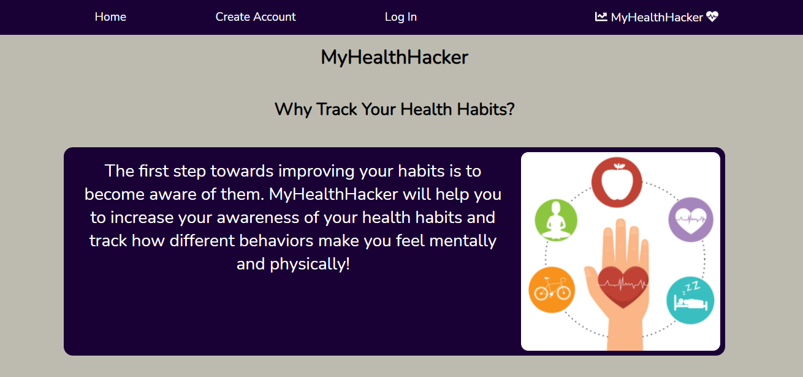
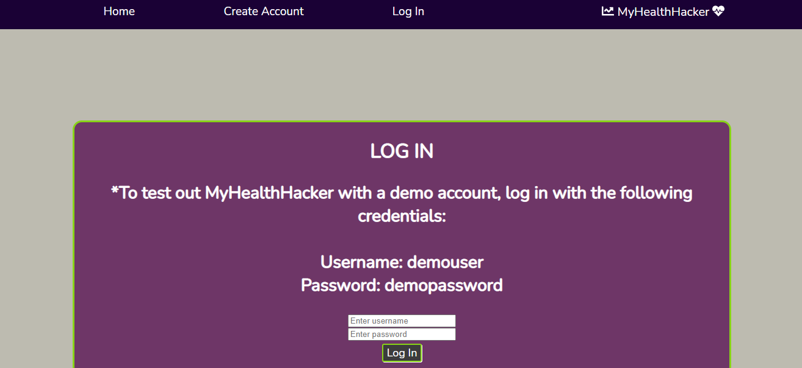
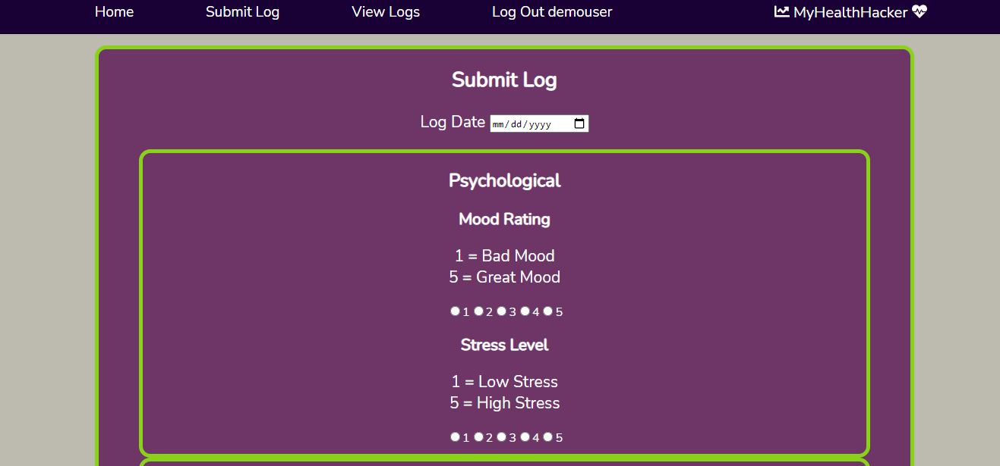
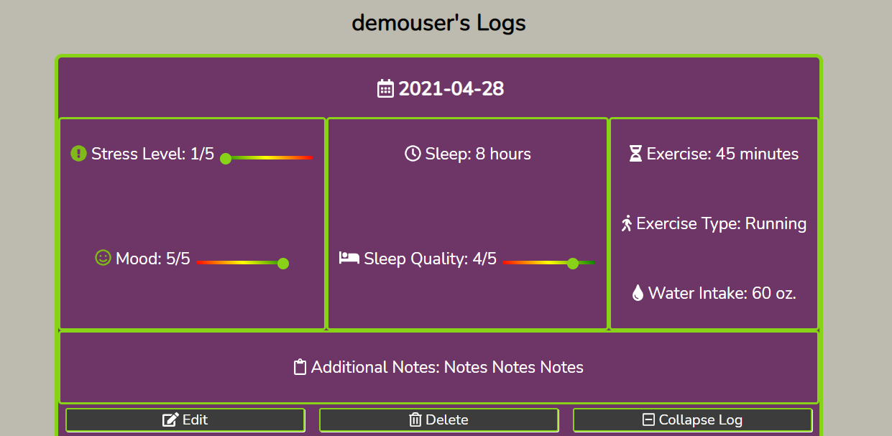

# MyHealthHacker

## Live Link

Visit [MyHealthHacker](https://myhealthhacker.vercel.app)

## About MyHealthHacker

MyHealthHacker helps users to track their health related habits such as sleep amount and quality, exercise, mood, stress and more. This helps users to notice and change behaviors to help them feel their best. 

## Technology

This fullstack application was built using:

- JavaScript

- React

- Nodejs

- PostgreSQL

- Express

- HTML

- CSS

## Link to API Repo

[API Link](https://github.com/julialj95/myhealthhacker-api)

## Screenshots

#### Home Page

#### Login Page

#### Log Submission Page

#### Saved Logs Page

